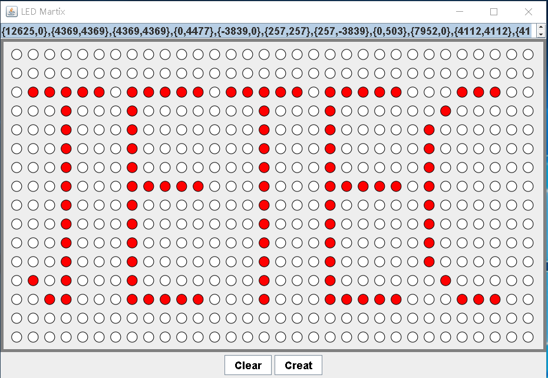

字幕機，LED 點矩陣，數值計算工具
======
MCU 於 RS232 接收傳感器資料，轉換成 LED 點矩陣訊息呈現，計算 LED 模組顯示資訊。

+ 獨立開發
+ 習得技能
    + Java Swing 與 AWT 視窗程式開發
+ 負責部分
    + 100% Java

### 相關連結
+ [PCBLayout - LED 點矩陣，電路板繪製](../Other/PCBLayout/Megawin564.md)
+ [AutoCad 3D - LED 點矩陣，字幕機概念圖](../Other/AutoCad/3d.md)