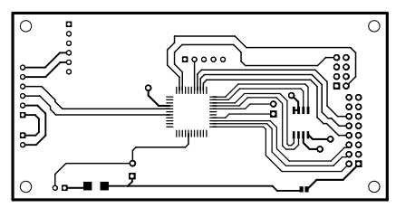

字幕機，LED 點矩陣，電路板繪製
======
Megawin564 單晶片，雙層板繪製，用於控制 LED 點矩陣驅動元件。

+ 獨立繪製
    + 團隊同仁指導
+ 習得技能
    + Altium Designer 
+ 負責部分
    + 100% PCB Layout
    + 100% 電路焊接

### 相關連結
+ [Java - LED 點矩陣，數值計算工具](../../Java/led_martix.md)
+ [AutoCad 3D - LED 點矩陣，字幕機概念圖](../../Other/AutoCad/3d.md)