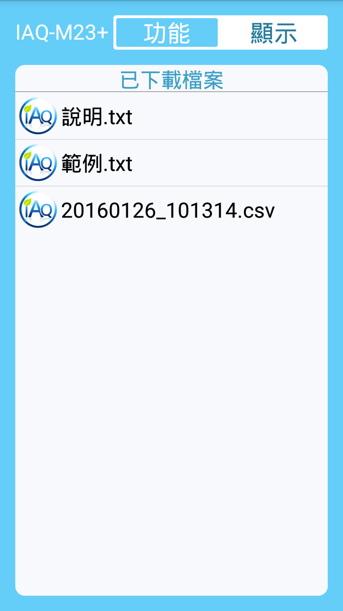
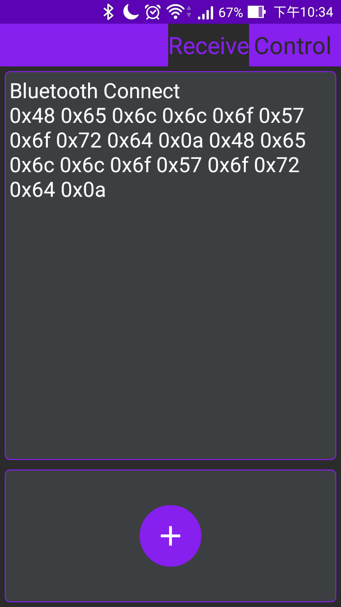

作品集 - 總集
======
個人整合的開發程式範例與過去工作作品介紹。

個人整合的開發程式範例，除可運行的代碼外，還包含單元測試與說明文檔，目的為保存開發時運用過的技術資訊，並將常用的類別與第三方元件封裝，應用快於速建置與共享協作，若有幫助歡迎取用。

過去工作作品，因涉及到機敏性資料僅包含於傳感器公司任職時的開發項目。未收錄於醫療資訊產業與政府標案內部系統專案項目。

[PDF 版本下載](https://drive.google.com/open?id=1V-rYUY20U8rzxCvMrkDU7Oyx3LI13bd9)

目錄
------
<table>
       <tr>
            <th>Side Project</th>
            <th>Work Sample</th>
        </tr>
        <tr>
            <td valign="top" width="450">
                <ul>
                    <li>Tunffli-智慧家居系統
                    </li>
                    <li>Java
                        <ul>
                            <li>JavaProjSE-v1.0.3</li>
                            <li>JUnitSE</li>
                            <li>SpringMVC-SE</li>
                            <li>MyBatisSE</li>
                        </ul>
                    </li>
                    <li>Android
                        <ul>
                            <li>AndroidProjSE</li>
                        </ul>
                    </li>
                    <li>iOS
                        <ul>
                            <li>SwiftProjSE</li>
                            <li>iOSProjUI</li>
                            <li>iOSProjSE</li>
                        </ul>
                    </li>
                    <li>Web
                        <ul>
                            <li>Html5ProjSE</li>
                            <li>jQueryProjSE</li>
                        </ul>
                    </li>
                    <li>DevOps
                        <ul>
                            <li>Git</li>
                            <li>GitLab</li>
                        </ul>
                    </li>
                </ul>
            </td>
            <td valign="top" width="450">
                <ul>
                    <li>WiNet-無線環境監控系統
                    </li>
                    <li>Android
                        <ul>
                            <li>IAQ-M23</li>
                            <li>JTC-X40</li>
                            <li>MeshTag</li>
                            <li>BthSE</li>
                        </ul>
                    </li>
                    <li>Web
                        <ul>
                            <li>公司後臺管理系統</li>
                            <li>電子網路商店</li>
                        </ul>
                    </li>
                    <li>Java
                        <ul>
                            <li>業務報表管理系統</li>
                            <li>LED點矩陣座標計算器</li>
                        </ul>
                    </li>
                    <li>Other
                        <ul>
                            <li>AutoCad 繪製</li>
                            <li>PCB Layout 繪製</li>
                        </ul>
                    </li>
                </ul>
            </td>
        </tr>
</table>

Side Project
------

### Tunffli-智慧家居系統
於 Linkit Smart 7688 開發板 ，Linux OpenWrt 的路由作業系統中，運行 Python 服務，透過 MQTT 消息傳輸協議，同步網頁畫面，視窗程式與手機應用各介面上的訊息，同時也可以反向控制板子達成電燈開關、攝影機視訊串流、音樂播放等功能。

+ GitHub - <https://github.com/RHZEnoxs/Tunffli>
+ Web Demo  - <https://rhzenoxs.github.io/Tunffli-View/>
+ 系統介紹 - <https://gitlab.com/Enoxs/Portfolio/blob/master/Tunffli/Tunffli.md>

### Java 
+ [JavaProjSE-v1.0.3](https://gitlab.com/EnoxsGroups/Program/JavaStudio/SE/JavaProjSE-v1.0.3)
     + Java 類別測試與第三方庫封裝
+ [JUnitSE](https://gitlab.com/EnoxsGroups/Program/JavaStudio/SE/JUnitSE)
     + JUnit4 框架測試與使用方法
+ [SpringMVC-SE](https://gitlab.com/EnoxsGroups/Program/JavaStudio/SE/SpringMVC-SE)
     + Spring MVC 框架測試與可執行範例
+ [MyBatisSE](https://gitlab.com/EnoxsGroups/Program/JavaStudio/SE/MyBatisSE)
     + MyBatis 框架測試與可執行範例

### Android
+ [AndroidProjSE](https://github.com/RHZEnoxs/AndroidProjSE-v1.0.2)
    + 使用 Square's Flow 的 MVP 設計模式呈現畫面，於啟動時以執行緒(CrashHandler) 監控程序是否發生崩潰，於發生崩潰時紀錄日誌與重啟應用，日誌以 logback 工具紀錄。
    
### iOS
+ [SwiftProjSE](https://gitlab.com/EnoxsGroups/Program/SwiftStudio/SE/SwiftProjSE)
     + Swift 特性測試與標準範例
+ [iOSProjUI](https://gitlab.com/EnoxsGroups/Program/SwiftStudio/SE/iOSProjUI)
     + iOS 視圖元件測試
+ [iOSProjSE](https://gitlab.com/EnoxsGroups/Program/SwiftStudio/SE/iOSProjSE) 
     + iOS 平臺功能測試

### Web
+ [Html5ProjSE](https://gitlab.com/EnoxsGroups/Program/WebStudio/SE/Html5ProjSE)
    + File API / 富文本編輯器
+ [jQueryProjSE](https://gitlab.com/EnoxsGroups/Program/WebStudio/SE/jQueryProjSE)
    + DataTable/Moment/Showdown/iCheck/QUnit
    
### DevOps
+ Git
    + Git 版本控制 - [sop](https://gitlab.com/Enoxs/Document/blob/master/DevOps/Git/Git-Sop%20v1.md) / [tip](https://gitlab.com/Enoxs/Document/blob/master/DevOps/Git/Git-Tip.md)
    + Git Flow 開發流程 - [git-flow](https://gitlab.com/Enoxs/Document/blob/master/DevOps/Git/Git-Flow.md)
+ GitLab
    + [安裝建置](https://gitlab.com/Enoxs/Document/blob/master/DevOps/Gitlab/GitLab-Install.md)
    + [定期備份](https://gitlab.com/Enoxs/Document/blob/master/DevOps/Gitlab/GitLab-Backup.md)
    + [整合LDAP](https://gitlab.com/Enoxs/Document/blob/master/DevOps/Gitlab/GitLab-LDAP.md)
    
Work Sample
------

### 無線環境監控系統 - WiNet
於 Linux OpenWrt 的路由作業環境下，搭建 Python 網頁伺服器，透過 MQTT 傳輸協議，同步 RS232 傳感器數據，即時呈現於網頁介面、視窗程式與手機應用上。

+ 系統介紹 - <https://gitlab.com/Enoxs/Portfolio/blob/master/WiNet/WiNet.md>
    + 架構圖
    + 公開的產品型錄

#### Web 介面

輕量級 Python Flask 框架後端建置，前端 jQuery + jQuery UI + Ajax 實作，感測器數值於　MQTT　消息協議同步後，由　Flask - SocketIO　功能即時呈現於前端介面。

#### Android 介面
手機端與目標主機建立連線，經由　MQTT　消息協議，解析　JSON 格式封包，同步裝置訊息。

### Android

#### 室內空氣品質監測 - IAQ-M23+
以藍芽通訊傳輸方式，下載室內空氣品質監測數據，提供趨勢圖表繪製與附件轉發功能。  

+ 專案介紹 - <https://gitlab.com/Enoxs/Portfolio/blob/master/Android/IAQ-M23+.md>
    + 公開的產品型錄

#### 大型顯示器 - JTC-X40
搭配大型顯示使用，提供藍芽連斷線 即時數值顯示功能，快速參數設定功能。
    

#### 藍芽 BLE 網狀拓樸 - MeshTag
藉由 藍芽 4.0 BLE 網狀拓樸功能，佈署至多32節點感測器。行動裝置數值即時顯示、遙控終端設備、設定測定間隔、警報設定、裝置設定。

+ 專案介紹 - <https://gitlab.com/Enoxs/Portfolio/blob/master/Android/MeshTag.md>
    + 公開的產品型錄

#### 藍芽傳輸開發工具 - BthSE
Android 藍芽資料傳輸測試工具，提供了16進制位元的發送與接收，並且可自訂最多 15 組的 10 Byte數據傳輸。

+ 專案介紹 - <https://gitlab.com/Enoxs/Portfolio/blob/master/Android/BthSE.md>
+ Github - <https://github.com/RHZEnoxs/Bth_SE>
     
### Web

#### 公司後台資訊
維護公司後台管理系統，自動化表單流程，解決重複作業導致人事效率降低問題。

##### 料件庫存管理系統

解決公司研發部、生產部、技術部，料件清點問題，避免每次採購缺額料件時
，都必須重新清點與跨部門整合數量問題。

##### 產品詢價系統

解決公司進口部與業務部產品報價問題，將原本的紙本化作業流程，移至線上處理，也同時降低因重複詢價導致人事效率降低的問題。

##### 維修紀錄表

##### 客訴紀錄表

##### 逾期貨款紀錄表

##### 獎懲紀錄表

##### 出勤紀錄表

#### 電子網路商店 - OpenCart

### Java 

#### 業務報表管理系統     
公司內部業務報表管理系統，用於紀錄客戶聯繫資訊，並有流程狀態追蹤案件。

#### 字幕機，LED 點矩陣，數值計算工具
MCU 於 RS232 接收傳感器資料，轉換成 LED 點矩陣訊息呈現，計算 LED 模組顯示資訊。

### Other

#### AutoCad 繪製

##### AutoCad 2D
###### 專題實驗室 2D 平面圖

大學專題課程，Wifi 室內定位功能，平面圖標示。

###### 產品外殼結構圖

傳感器產品外殼，加工規格標示

##### AutoCad 3D

###### 字幕機，LED 點矩陣，3D 概念圖

---

#### PCB Layout 繪製

##### 字幕機，LED 點矩陣，電路板繪製
Megawin564 單晶片，雙層板繪製，用於控制 LED 點矩陣驅動元件。

