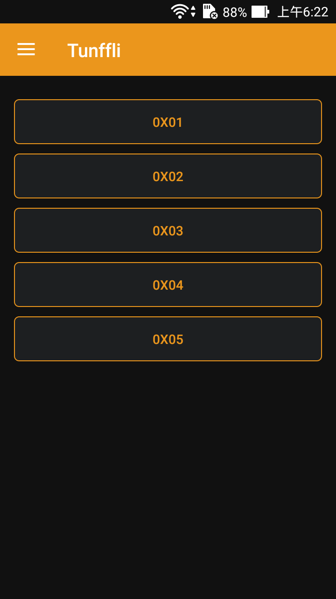
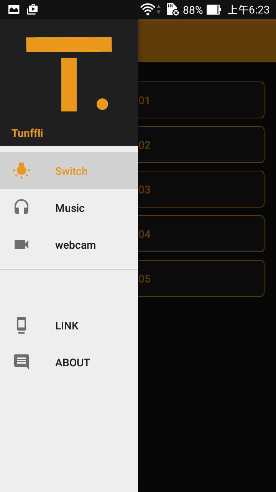

智慧家居系統 Tunffli -  Android 應用程式
======
Android 實作功能介面

+ MQTT 傳輸 參考 MQTT Example
    + <https://github.com/agoransson/mqtt4android>
+ Webcam 功能參照 ipcam-view
    + <https://github.com/niqdev/ipcam-view>

### 相關連結
+ [智慧家居系統 - Tunffli](Tunffli.md)