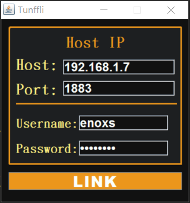
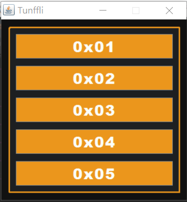

智慧家居系統 Tunffli -  Java 視窗程式
======
Java Swing 實作功能介面，MQTT 傳輸協議參考 IBM Mqtt 範例 paho-mqtt，攝影機視訊串流部份未實作，僅開啟指定網頁頁面。

+ paho-mqtt
    + <https://eclipse.org/paho/>

### 相關連結
+ [智慧家居系統 - Tunffli](Tunffli.md)