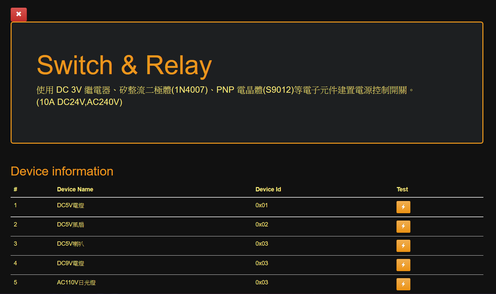

智慧家居系統 Tunffli -  Web 介面
======
Python Flask 輕量級網頁框架建置，Bootstrap + Ajax 前端實作。

## <https://rhzenoxs.github.io/Tunffli-View/>

### 設計風格
黑色背景代表關掉電燈，橘黃色代表適合家居的暖白光，加上隨著鼠標產生的三角漣漪，成為整體系統設計的主要元素

### 網頁路由設定
覆寫聯發科物聯網實驗室開源範例，自定義系統與網路界面，可設定裝置名稱、登錄密碼與網路連接模式。

+ <https://github.com/MediaTek-Labs/linkit-smart-7688-webUI>

#### 開關控制

### 音樂播放

### 攝影機視訊串流

### 安全機制(規劃中，後端尚未實作)

### 相關連結
+ [智慧家居系統 - Tunffli](Tunffli.md)