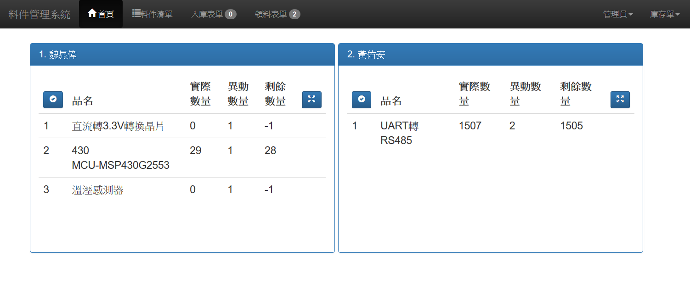
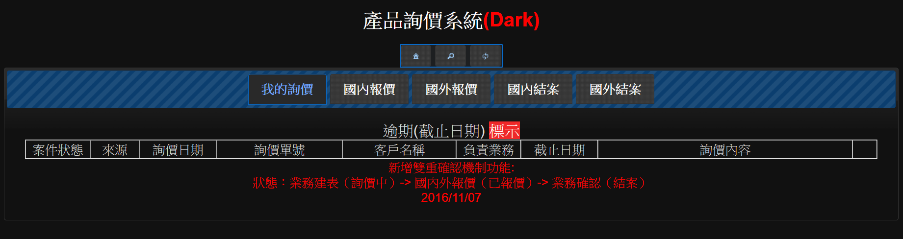
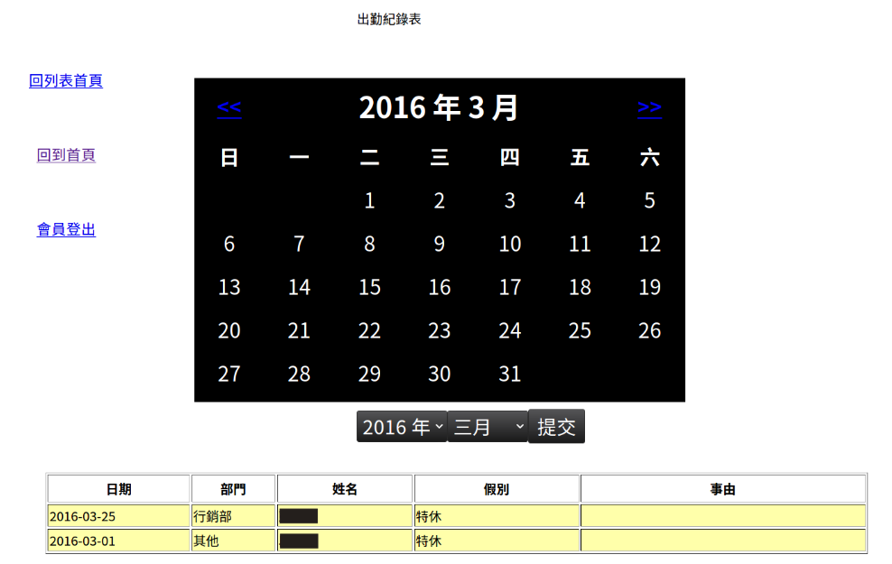

公司後台資訊
======
維護公司後台管理系統，自動化表單流程，解決重複作業導致人事效率降低問題。

+ 獨立開發
+ 習得技能
    + Ajax 異步請求 
    + jQuery 庫
    + BootStrap 前端框架
    + PHP 後端接口
    + MySQL 資料庫規劃
+ 負責部分
    + 100 % Web 前後端

+ 擴增 7 項表單功能
    + 料件庫存管理系統
    + 產品詢價系統
    + 維修紀錄表
    + 客訴紀錄表
    + 逾期貨款紀錄表
    + 獎懲紀錄表
    + 出勤紀錄表

### 料件庫存管理系統

解決公司研發部、生產部、技術部，料件清點問題，避免每次採購缺額料件時
，都必須重新清點與跨部門整合數量問題。

### 產品詢價系統

解決公司進口部與業務部產品報價問題，將原本的紙本化作業流程，移至線上處理，也同時降低因重複詢價導致人事效率降低的問題。

### 維修紀錄表

### 客訴紀錄表

### 逾期貨款紀錄表

### 獎懲紀錄表

### 出勤紀錄表

