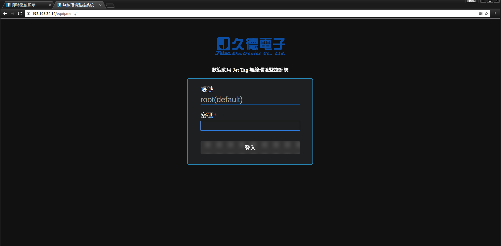
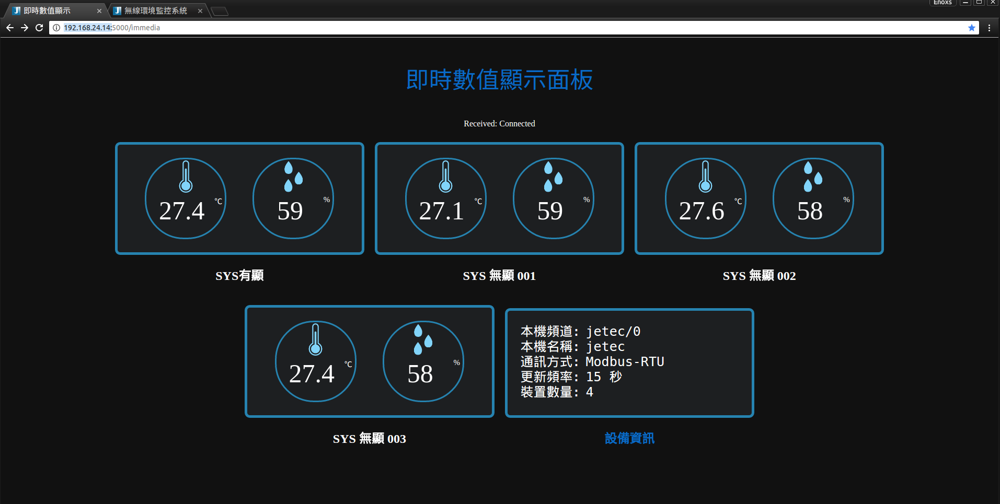
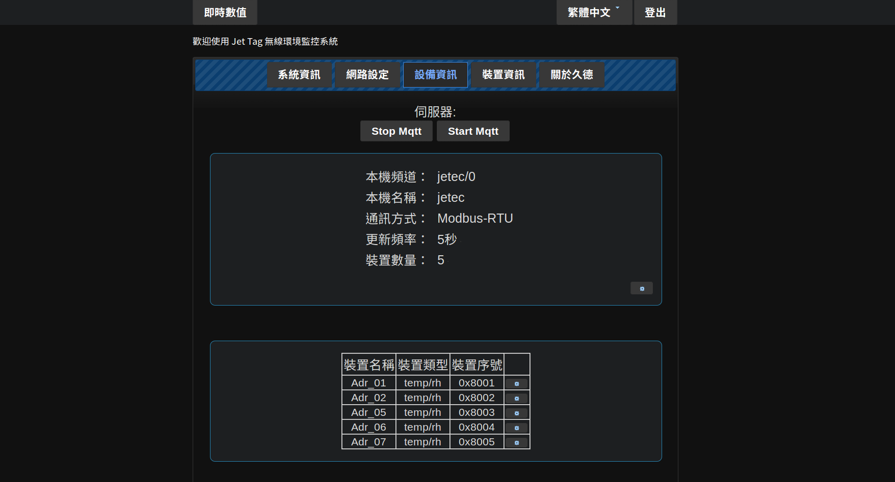

無線環境監控系統 - WiNet
======
於 Linux OpenWrt 的路由作業環境下，搭建 Python 網頁伺服器，透過 MQTT 傳輸協議，同步 RS232 傳感器數據，即時呈現於網頁介面、視窗程式與手機應用上。

+ 協作開發
+ 習得技能
    + Linux (OpenWrt) 環境開發
    + Python (Flask) 網站框架
    + MQTT 通訊協議
    + Ajax 非同步
    + jQuery 前端  
+ 負責部分
    + 100 % Android
    + 100 % Web 前端
    + 50 % Python 後端

### 架構圖 

### Web 介面

輕量級 Python Flask 框架後端建置，前端 jQuery + jQuery UI + Ajax 實作，感測器數值於　MQTT　消息協議同步後，由　Flask - SocketIO　功能即時呈現於前端介面。

### Android 介面

手機端與目標主機建立連線，經由　MQTT　消息協議，解析　JSON 格式封包，同步裝置訊息。

### 產品型錄

&nbsp;

